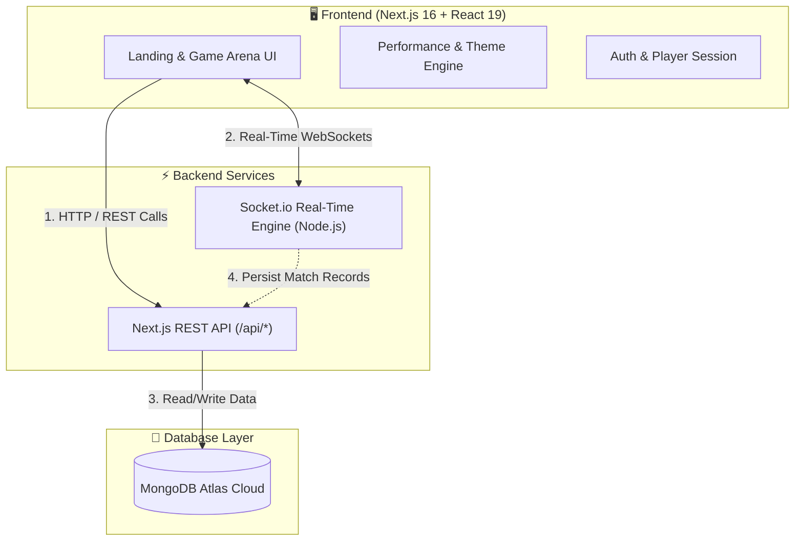

<div align="center">

# 🎮 GamePortal
### The Next-Generation Browser Arcade & Real-Time Multiplayer Arena

[-black?style=for-the-badge&logo=next.js&logoColor=white)](https://nextjs.org/)
[](https://react.dev/)
[](https://www.typescriptlang.org/)
[](https://tailwindcss.com/)
[](https://threejs.org/)
[](https://socket.io/)
[](https://www.mongodb.com/)
[](LICENSE)

<p align="center">
  <b>A unified, zero-install web gaming platform built with modern web technologies.</b><br/>
  Featuring 12 logic puzzles, arcade classics, and real-time multiplayer duels with zero-latency synchronization, global leaderboards, adaptive 3D graphics, and 60 FPS Eco-Performance optimization.
</p>

[✨ Live Demo](#-quick-start-local-development) • [🕹️ Games Library](#-games-library) • [🏗️ Architecture](#-system-architecture) • [🚀 Quick Start](#-quick-start-local-development) • [⚡ Performance System](#-adaptive-performance--graphics-system)

---

</div>

## 🌟 Highlights & Key Features

- 🎯 **12 Fully Playable Games**: From competitive 1v1 multiplayer duels (Chess, Caro, Monopoly, Battleship) to solo puzzles and arcade classics (2048, Minesweeper, Sudoku, Wordle, Flappy Bird).
- ⚡ **Zero-Latency Real-Time Engine**: Built on Socket.io with room matchmaking, reconnection tolerance, game clock synchronization, and spectator-ready lobbies.
- 🎨 **State-of-the-Art Visual Aesthetics**: Designed with modern glassmorphism, dynamic micro-interactions (Framer Motion), interactive 3D WebGL hero canvas (Three.js), and cohesive dark/light palettes.
- 🚀 **Adaptive 60 FPS Performance System**: Integrated hardware detection (`PerformanceProvider`) with a 1-click **Eco Mode (`⚡ Eco 60fps`)** toggle for non-dedicated GPU and low-spec machines.
- 🏆 **Global Leaderboards & Head-to-Head Tracking**: Persistent cloud database storing personal bests, Elo-styled win rates, and direct rival match history.
- 🔐 **Frictionless Authentication**: Instant zero-password onboarding with custom avatar uploads and cloud-synced player profiles.

---

## 🕹️ Games Library

| Game | Mode | Category | Engine & Key Features |
| :--- | :---: | :---: | :--- |
| **[Chess](src/games/chess)** | ⚔️ 1v1 Online / AI | Strategy | Standard FIDE chess rules, 15-minute game clocks, move validation via `chess.js`, and FEN state synchronization. |
| **[Caro (Gomoku)](src/games/caro)** | ⚔️ 1v1 Online | Board Game | 25×25 tactical grid, real-time move validation, 30s turn countdown, and O(1) winning cell detection with `React.memo` optimization. |
| **[Monopoly](src/games/monopoly)** | ⚔️ 2–4P Online | Board Game | 32-space interactive board with 3D dice physics, property acquisitions, house/hotel upgrades, World Tour flights, and bankruptcy resolution. |
| **[Battleship](src/games/battleship)** | ⚔️ 1v1 Online | Tactical Combat | 10×10 naval grid, strategic fleet deployment (Carrier, Battleship, Cruiser, Submarine, Destroyer), fog-of-war, and radar animations. |
| **[Word Chain (Nối Chữ)](src/games/wordchain)** | ⚔️ 1v1 Online | Word Game | Fast-paced bilingual (Vietnamese & English) vocabulary chain game with real-time dictionary validation and combo multipliers. |
| **[2048](src/games/2048)** | 🧠 Solo | Logic Puzzle | Smooth tile sliding physics, keyboard/swipe controls, score multipliers, and undo move mechanics. |
| **[Minesweeper](src/games/minesweeper)** | 🧠 Solo | Classic Logic | Beginner (9×9), Intermediate (16×16), and Expert (30×16) boards with chording (auto-clear), flag placement, and sub-millisecond timers. |
| **[Sudoku](src/games/sudoku)** | 🧠 Solo | Number Puzzle | 9×9 grid with Easy, Medium, and Hard difficulty presets. Features pencil/notes mode, auto-highlighting, and an error-tracking heart system. |
| **[Wordle](src/games/wordle)** | 🧠 Solo | Word Puzzle | 5-letter daily mystery word challenge with color-coded feedback (Green/Yellow/Gray), physical keyboard support, and streak tracking. |
| **[Aim Trainer](src/games/aimtrainer)** | ⚡ Solo | Reflex Action | 60-second reaction time and precision target trial with click accuracy percentage and real-time score counters. |
| **[T-Rex Runner](src/games/trex)** | 🏃 Solo | Endless Arcade | High-performance HTML5 Canvas infinite runner with jump/duck physics, cactus & pterodactyl obstacles, and day/night transitions. |
| **[Flappy Bird](src/games/flappybird)** | 🐤 Solo | Endless Arcade | Responsive HTML5 Canvas flight game with tap/keyboard controls, progressive pipe speed, shrinking gaps, collision detection, and local high scores. |

---

## 🏗️ System Architecture



---

## ⚡ Adaptive Performance & Graphics System

GamePortal introduces an intelligent multi-tiered graphics pipeline designed to run flawlessly across everything from high-end gaming rigs to low-power laptops and mobile devices.

```
┌──────────────────────────────────────────────────────────────────────────┐
│                      🎮 GRAPHICS PIPELINE MODES                         │
├─────────────────────────────────────┬────────────────────────────────────┤
│ 🎮 Ultra 3D Mode (High Quality)     │ ⚡ Eco 60 FPS Mode (Low Power / iGPU)│
├─────────────────────────────────────┼────────────────────────────────────┤
│ • Interactive Three.js WebGL Core   │ • 0% WebGL GPU Load (CSS Aurora)   │
│ • 3D Mouse Spring Parallax Bento    │ • GPU-Accelerated 2D Transform     │
│ • Multi-Light Shading & Particles   │ • Zero Layout Thrashing            │
│ • Smooth Lenis Momentum Scroll      │ • Native Hardware Touch Scrolling  │
│ • Real-time Viewport Auto-Pause     │ • Solid Surface Composite Layers   │
└─────────────────────────────────────┴────────────────────────────────────┘
```

- **Viewport Auto-Pausing**: Three.js WebGL rendering loops are wrapped in `IntersectionObserver` and `visibilitychange` listeners, dropping GPU/CPU utilization to **0%** whenever the Hero section is out of view.
- **Hardware Auto-Detection**: Devices with low CPU concurrency (`<= 4 cores`) or active `prefers-reduced-motion` automatically launch in high-efficiency Eco mode.
- **Navbar Quick-Toggle**: Users can toggle between `⚡ Eco 60fps` and `🎮 3D High` at any time with zero page reloads.

---

## 📁 Repository Structure

```text
game-app/
├── src/
│   ├── app/                      # Next.js App Router (Pages & API routes)
│   │   ├── api/                  # REST API endpoints (Auth, Leaderboard, Matches)
│   │   ├── games/                # Game routes (/games/chess, /games/monopoly, etc.)
│   │   ├── leaderboard/          # Global ranking leaderboard page
│   │   ├── globals.css           # Global Tailwind CSS v4 & design tokens
│   │   └── layout.tsx            # Root layout with Theme & Performance providers
│   ├── components/
│   │   ├── auth/                 # Frictionless login & profile modals
│   │   ├── landing/              # Hero3D, Bento Grid, Daily Spotlight, Active Rooms
│   │   └── shared/               # Navbar, Footer, GameCard, PerformanceProvider
│   ├── config/                   # Game metadata registry (games.ts)
│   ├── games/                    # Individual Game engines and components
│   │   ├── 2048/                 # 2048 tile engine
│   │   ├── aimtrainer/           # Precision click reflex engine
│   │   ├── battleship/           # Naval combat strategy engine
│   │   ├── caro/                 # Gomoku 25x25 memoized grid
│   │   ├── chess/                # FIDE Chess clock & move synchronizer
│   │   ├── minesweeper/          # Chording minefield engine
│   │   ├── monopoly/             # Monopoly board, travel, and trading logic
│   │   ├── sudoku/               # 9x9 generator with pencil notes
│   │   ├── trex/                 # Canvas-based 60 FPS dino runner
│   │   ├── flappybird/           # Canvas-based endless flight game
│   │   ├── wordchain/            # Vietnamese/English dictionary word chain
│   │   └── wordle/               # Wordle letter solver
│   ├── lib/                      # MongoDB connection & Mongoose schemas
│   └── types/                    # Shared TypeScript interfaces & socket events
├── socket-server/                # Standalone Node.js Socket.io server
│   ├── handlers.ts               # Real-time game logic handlers (Monopoly, Chess, etc.)
│   ├── server.ts                 # Express & Socket.io server entry point
│   └── types.ts                  # Socket event signatures
└── public/                       # Static game assets, icons, and sounds
```

---

## 🚀 Quick Start (Local Development)

### Prerequisites
- **Node.js**: v20.x or higher
- **npm** / **pnpm** / **yarn**
- **MongoDB**: Local instance or free [MongoDB Atlas](https://www.mongodb.com/atlas) cluster

### 1. Clone the Repository
```bash
git clone https://github.com/lehuuhlong/game-app.git
cd game-app
```

### 2. Install Dependencies
```bash
# Install frontend dependencies
npm install

# Install socket server dependencies
cd socket-server
npm install
cd ..
```

### 3. Environment Variables
Create a `.env.local` file in the root directory:
```env
# MongoDB Atlas Connection URI
MONGODB_URI=mongodb+srv://<username>:<password>@cluster.mongodb.net/game-portal?retryWrites=true&w=majority

# Real-time WebSocket Server URL
NEXT_PUBLIC_SOCKET_URL=http://localhost:4000
```

### 4. Run Development Servers
Launch both the frontend client and the socket server simultaneously:

```bash
# Terminal 1: Next.js Frontend (Runs on http://localhost:3000)
npm run dev

# Terminal 2: Socket.io Real-Time Server (Runs on http://localhost:4000)
cd socket-server
npm run dev
```

Visit `http://localhost:3000` in your browser.

---

## 🌐 Production Deployment

GamePortal is architected for decoupled zero-downtime deployment:

### 1. Deploy the Real-Time Socket Server (e.g. Railway / Render / Fly.io)
1. Deploy the `/socket-server` directory to a platform supporting WebSockets.
2. Set Environment Variables:
   - `PORT` = `4000`
   - `CLIENT_ORIGIN` = `https://your-frontend-domain.vercel.app`
3. Copy your live Socket server public URL (e.g., `https://game-socket.up.railway.app`).

### 2. Deploy the Next.js Frontend (e.g. Vercel)
1. Import the root repository into [Vercel](https://vercel.com).
2. Configure Environment Variables in Vercel Project Settings:
   - `MONGODB_URI` = Your production MongoDB connection string.
   - `NEXT_PUBLIC_SOCKET_URL` = Your live Socket server URL from Step 1.
3. Deploy!

---

## 🛠️ Tech Stack & Libraries

| Domain | Technologies |
| :--- | :--- |
| **Frontend Framework** | [Next.js 16.2](https://nextjs.org/) (App Router, Turbopack, Server Actions), [React 19](https://react.dev/) |
| **Language & Typings** | [TypeScript 5.x](https://www.typescriptlang.org/) |
| **Styling & Design** | [Tailwind CSS v4](https://tailwindcss.com/), CSS Custom Properties, Glassmorphism |
| **3D & Motion** | [Three.js](https://threejs.org/) (WebGL), [Framer Motion](https://www.framer.com/motion/), [Lenis](https://github.com/darkroomengineering/lenis) |
| **Real-Time WebSockets** | [Socket.io 4.x](https://socket.io/), [Socket.io Client](https://socket.io/docs/v4/client-api/) |
| **Database & ODM** | [MongoDB Atlas](https://www.mongodb.com/), [Mongoose](https://mongoosejs.com/) |
| **Game Engines** | [chess.js](https://github.com/jhlywa/chess.js), HTML5 2D Canvas Engine |

---

## 🤝 Contributing

Contributions, issues, and feature requests are welcome!
1. Fork the Project
2. Create your Feature Branch (`git checkout -b feature/AmazingGame`)
3. Commit your Changes (`git commit -m 'Add new multiplayer puzzle'`)
4. Push to the Branch (`git push origin feature/AmazingGame`)
5. Open a Pull Request

---

## 📄 License

Distributed under the **MIT License**. See [`LICENSE`](LICENSE) for more information.

<div align="center">
  <sub>Built with precision and passion by <a href="https://github.com/lehuuhlong">Le Huu Hoang Long</a>.</sub>
</div>
